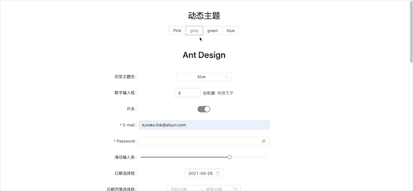

# umi + antd 动态主题色

 


## 详细文章链接如下：
https://www.jianshu.com/p/87023e7f34c6


## 开始

Install dependencies,

```bash
$ yarn
```

Start the dev server,

```bash
$ yarn start
```


## 前言
本人项目使用的 ui 库为 antd，样式为 less。

主题色的变化，antd 官网提供了相关的方案：[定制主题](https://ant.design/docs/react/customize-theme-cn)，但是，该方案我是静态的换肤，也就是需要你已经知道你系统需要什么样的主题色了，你根据相关的配置，antd 自动帮你做转化。

我接下来要讲的动态主题色变化，也就是，你的页面可能会有10种，或者20种颜色需要切换，你也不知道到底有多少种颜色，同时，文档也考虑到多人协助开发，开发人员只需要按照约定方式去编写样式、以及，主题文件名、目录等命名规范，是本人真实项目应用总结。

**主要思路：动态插入样式，覆盖系统已经编译好的相关样式，包括 UI 组件库 和 自定义样式。**

